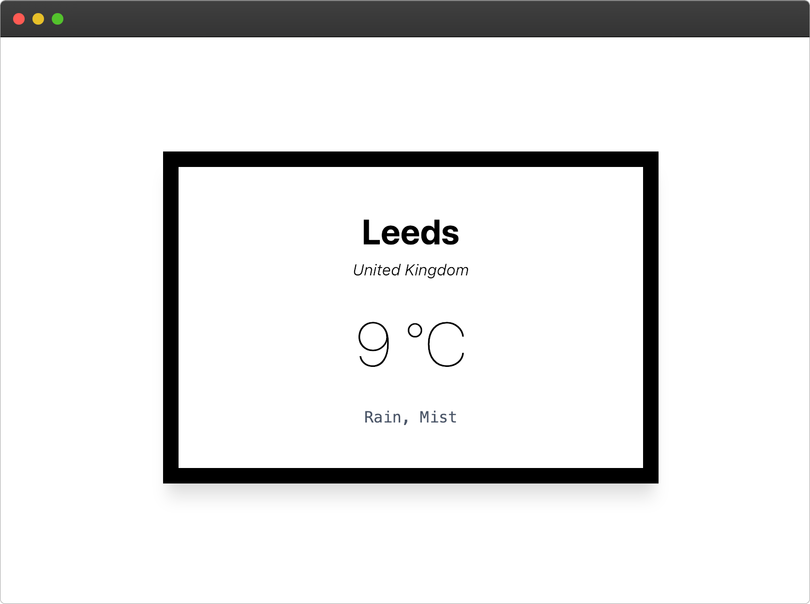
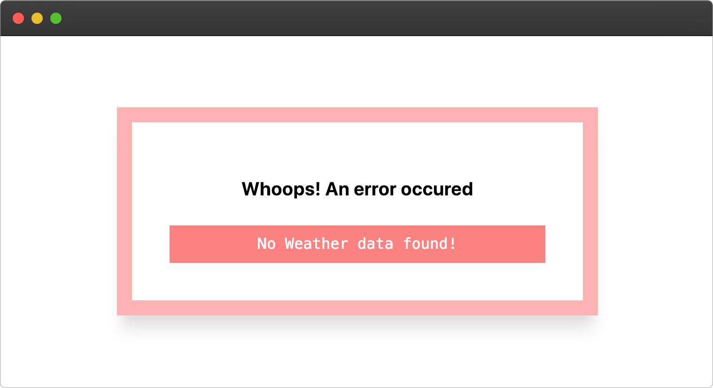

# Serverless Weather App 🌦🏗ƛ

 
    
    

This is a simple weather widget built using a lambda function sitting infront of an API Gateway to handle requests.

The lambda is responsible of making API calls and fetching the weather for your location which is geolocated using your IP Address. This of course isn't a super accurate identifier, so I have added support of passing query string parameters for finer grained control on the weather data.

This project is built using TypeScipt and Terraform and hosted on the AWS cloud.

## Deployment
### Scripts
- Run `yarn zip` to archive together the code
- Run `yarn build` to compile ts code to js code
- Run `yarn tf:init` to get aws provider plugin downloaded
- Run `yarn tf:plan` to see changes that will be made
- Run `yarn tf:apply` to actually make those changes to your provider
- Visit AWS and see all your services provisioned via terraform
- Run `yarn tf:destroy` to destroy all the services that were built

You can also simply call `yarn deploy:all` to both zip up an archive and provision the resources together. As well as calling `yarn update:all` to completely destroy and re-deploy resources.

### KMS
This project makes use of Amazon KMS for encryption and decryption of sensitive variables. 

``Note: You may need to set a KMS key up if you dont already have one, you may also need the AWS CLI to encrypt variables.``

In the terraform config directory is a `tfvars file` which will need to be updated with your KMS encrypted variables. Once this is done and your KMS key is allowed to consumed by your lambda you should be able to decrypt the values on the lambda itself.

## Usage
Simply deploy the project and access it via the api gateway url you will receive in the deployment stage.

By default the lambda will use your IP address for geo-location and fetching of weather. However this is not super accurate and can be spoofed, this is why i added support for query string params. You are able to pass a city parameter to allow more fine grain control. If a query string is passed, it will be preffered to the IP address.

---

 
    ☀️🌤🌧⛈🌨❄️

